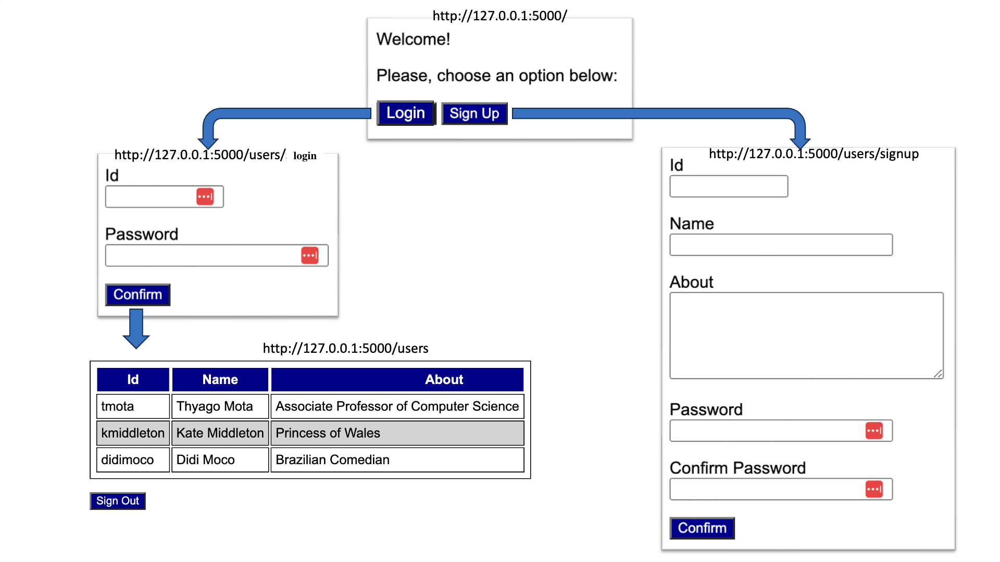
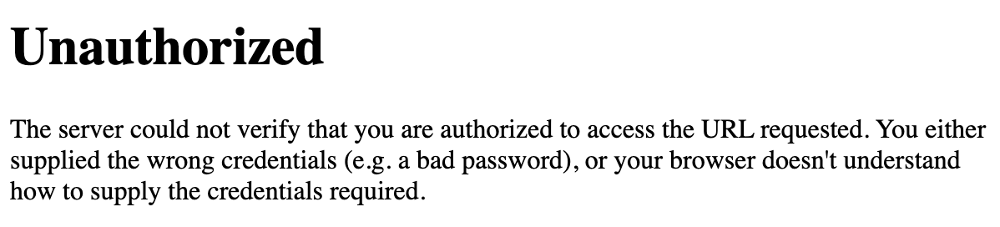

# Overview

In this homework assignment, you are asked to incorporate authentication into the simple web application described below. You will implement this using appropriate screens (e.g., login, registration) and URL paths to manage user access and navigation.



Attempting to open the /users page without being signed in should result in the following error message.



The app is organized as follows:

```
src
|__ app
|____ __init__.py
|____ forms.py
|____ models.py
|____ routes.py
static
|__ style.css
templates
|__ base.html
|__ index.html
|__ login.html
|__ signup.html
|__ users.html
```

Most of the code required for this web application has been provided. Your task is to complete the key components necessary to get the app fully functional.

# Setup 

You are required to install the following Python packages: 

```
flask
flask-wtf
flask-sqlalchemy
flask-login
bcrypt
```

There is a **requirements.txt** file that you can use to install all of the packages above using: 

```
pip3 install -r requirements.txt
```

You will also need to define the following environment variables: 

```
export FLASK_APP=src/app
export SECRET_KEY='The quick brown fox jumps over the lazy dog!'
```

Note that the app's secret key (used to sign cookies) is defined as an environment variable for extra security. 

# Flask-Login 

User authentication is a fundamental requirement in virtually all software applications. [Flask-Login](https://flask-login.readthedocs.io/en/latest/) is a helpful package that simplifies the process of authenticating users in Flask web apps and managing user sessions.

A session allows a web application to maintain state information associated with individual users across multiple requests.

Flask-Login provides a LoginManager class to handle user session management. The code snippet below demonstrates how to configure the login manager for your Flask application.

```
# login manager
from flask_login import LoginManager
login_manager = LoginManager()
login_manager.init_app(app)
```

In this assignment, **Flask-Login** will be used in conjunction with **SQLAlchemy**.  The following **User** model will be used: 

```
class User(db.Model, UserMixin):
    __tablename__ = 'users'
    id = db.Column(db.String, primary_key=True)
    name = db.Column(db.String)
    about = db.Column(db.String)
    passwd_salt = db.Column(db.LargeBinary)
    passwd_hashed = db.Column(db.LargeBinary)
```

As shown in the definition above, a **User** is characterized by an ID, name, bio (about), password salt, and a hashed password. When storing user credentials in a database (such as SQLite), it is strongly recommended to hash passwords rather than storing them in plain text.

A hashing algorithm—such as SHA, MD5, or BCrypt—transforms a plaintext password into an unintelligible string of characters. In the event of a security breach, these hashed passwords are meaningless without the original input, making unauthorized access significantly more difficult.

For added security, it's also recommended to use a salt—a random sequence of characters added to the password before hashing. Salting helps prevent attackers from using precomputed hash tables (like rainbow tables) to reverse-engineer passwords, even if the database is compromised.

Flask-Login requires the definition of a "user_loader" callback function, which is used to load a user object from the datastore (in our example, an SQLite db). Below is a typical implementation for the "user_loader" callback. 

```
# user_loader callback
@login_manager.user_loader
def load_user(id):
    return db.session.query(User).filter(User.id==id).one()
```

# Instructions

## TO-DO #1 - User's Sign Up 

The sign-up feature allows users to create their credentials and register for the web app. Use the provided SignUpForm class along with the signup.html template to collect user input.

If the entered passwords match, generate a salted and hashed password using the bcrypt library. You can learn how to do this [here](https://pypi.org/project/bcrypt/).

Next, store the user's information in the database by creating a new User object and persisting it using SQLAlchemy. Refer to the SQLAlchemy [session documentation](https://docs.sqlalchemy.org/en/20/orm/session_basics.html) for guidance.

Once the user is successfully saved, redirect them to the index page.

## TO-DO #2 User's Login

Use the provided LoginForm class along with the login.html template to collect the user's ID and password.

After retrieving the user’s credentials:

* Check if the entered password matches the one stored in the database.
* If the credentials are valid, authenticate the user using Flask-Login’s login_user function.
* Upon successful login, redirect the user to the /users page.

## TO-DO #3 User Sign Out

When a user clicks the sign-out button, you should remove their information from the current session using Flask-Login’s logout_user function. After logging the user out, redirect them to the home page ("/").

# Submission 

Once you are done completing all to-do's, submit all code changed by updating your GitHub repository. 

# Rubric 

This homework is worth 5 points distributed like the following: 

+2 TO-DO #1 

+2 TO-DO #2 

+1 TO-DO #3

+1 BONUS (redirect to error page when passwords do not match)